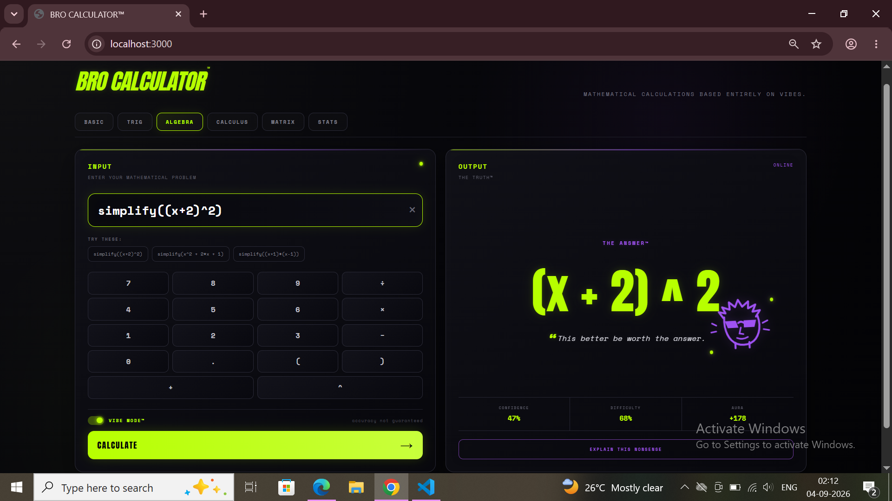
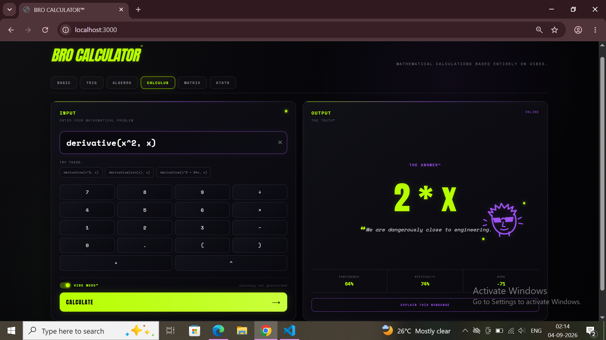

# The BRO Calculator 🎯

## Basic Details
### Team Name: Mango

### Team Members
- Member 1: Meghna Rajesh Vichattu - Model Engineering College
- Member 3: Shivani S Nair - Model Engineering College

### Project Description
BRO Calculator™ is a completely unnecessary calculator that takes ordinary mathematical problems and solves them using vibes, questionable confidence, and controlled chaos.
Unlike boring calculators that insist on being correct, BRO Calculator may confidently give you the wrong answer, randomly refuse to calculate, or experience a full-blown mathematical glitch.

### The Problem (that doesn't exist)
Traditional calculators have a serious flaw: they always cooperate. They are too predictable and give us answers whether they want to or not.

### The Solution (that nobody asked for)
BRO Calculator gives calculators a choice- solve the problem or simply say 'nah bro'.

## Technical Details
### Technologies/Components Used
For Software:
- Java Script, HTML, CSS
- Node.js, Express.js
- Math.js, CORS
- Visual Studio Code, Git, GitHub, Node Package Manager (npm)

### Implementation
For Software:
BRO Calculator consists of three main parts:

1. Frontend
The frontend provides the calculator interface, category selection, input system, keypad, result display, animations, and visual glitch effects.

2. Backend
The Node.js + Express backend receives mathematical expressions and communicates with the calculation engine.

3. BRO Chaos Engine™
The chaos engine decides whether BRO will:
Calculate correctly.
Produce a wrong answer.
Refuse to calculate.
Corrupt the result.
Generate a suspiciously confident response.

The final result is then returned to the frontend and displayed to the user.
# Installation
Clone the repository:

git clone <C:\Users\Lenovo\useless_project_temp>

Navigate into the backend directory:

cd useless_project_temp/backend

Install dependencies:

npm install

# Run
Start the server:

npm start

Then open:

http://localhost:3000

### Project Documentation
For Software:

# Screenshots (Add at least 3)
[alt text](image.png)
The image above shows the basic interface of the BRO Calculator.

[alt text](image-1.png)
Ocassionally the incorrect answer is displayed.

[alt text](image-2.png)
The BRO Calculator may also refuse to answer your questions.

Useless answers may also be provided.

Rarely, BRO might decide to bless us with the right answers.

# Diagrams
The workflow showing how a mathematical expression travels from the frontend to the backend, through the BRO Chaos Engine™, and back to the user as a suspiciously confident answer.

Basic Flow
User enters equation
        ↓
Frontend
        ↓
Express API
        ↓
Math.js
        ↓
BRO Chaos Engine™
        ↓
 ┌───────────────┐
 │               │
Correct       Wrong
 │               │
 └───────┬───────┘
         ↓
      Glitch?
         ↓
   BRO Response
         ↓
      Frontend
         ↓
   User questions life

### Project Demo
# Video
<video src="./WhatsApp%20Video%202026-09-04%20at%2003.12.43.mp4" controls width="100%"></video>
During this demonstration, we witness the BRO Calculator producing the wrong answer, the correct answer and then glitching to the incorrect output as well as outright refusing to solve the equation as well.

## Team Contributions
- Meghna: backend (package.json, server.js, broEngine.js)
- Shivani: frontend (index.html, script.js, style.css)

---
Made with ❤️ at TinkerHub Useless Projects 

